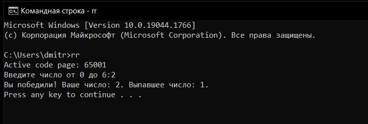

# Русская рулетка в `.bat` файле

Загадывайте любое число от 0 до 6. Если число, выпавшее у системы, совпадает с вашим, вы проиграли. Если число не совпадает, вы победили.

---
## Установка
Для того, чтобы установить файл и использовать его везде, берем его и переносим по пути `C:\Windows\System32`

Теперь, вы можете использовать его в командной строке, введя `rr`.

